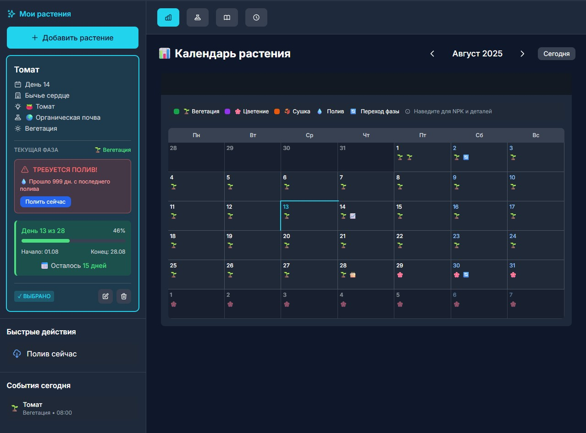
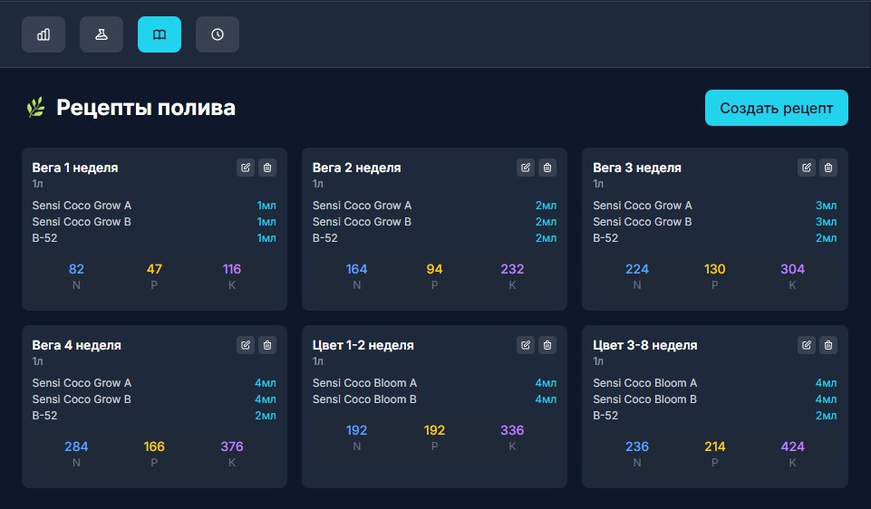
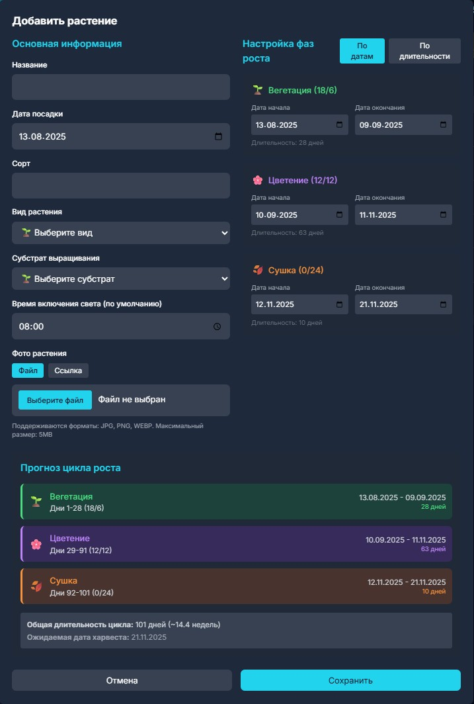
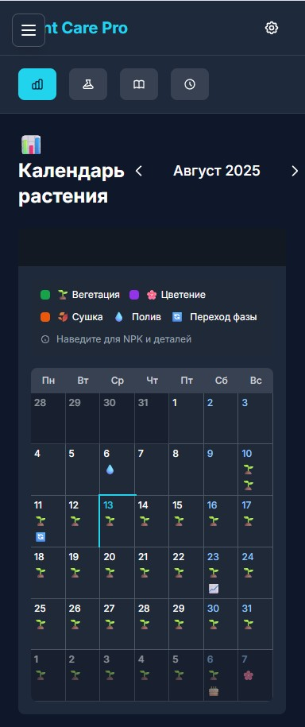

<h1>🌱 Plant Care Pro</h1>

Профессиональная веб-система для ухода за комнатными растениями с интуитивно понятным интерфейсом и мощными возможностями отслеживания.

<h2>📸 Скриншоты</h2>

  
  
  
  

<h2>✨ Основные возможности</h2>
<h3>📊 Управление растениями</h3>
<ul>
<li><strong>Каталог растений</strong>: Добавление, редактирование и удаление растений</li>
<li><strong>Детальные профили</strong>: Фото, название, тип, местоположение и заметки</li>
<li><strong>Календарь ухода</strong>: Автоматические напоминания о поливе, удобрении и пересадке</li>
<li><strong>История действий</strong>: Полный журнал всех операций по уходу</li>
</ul>
<h3>📅 Планирование и напоминания</h3>
<ul>
<li><strong>Календарь событий</strong>: Визуальный календарь с предстоящими задачами</li>
<li><strong>Умные напоминания</strong>: Автоматический расчет следующего полива</li>
<li><strong>Быстрые действия</strong>: Мгновенная отметка выполненных операций</li>
<li><strong>Статистика</strong>: Аналитика и графики активности ухода</li>
</ul>
<h3>🎨 Современный интерфейс</h3>
<ul>
<li><strong>Темная тема</strong>: Стильный темный дизайн с акцентными цветами</li>
<li><strong>Адаптивность</strong>: Полная поддержка мобильных устройств</li>
<li><strong>Интуитивность</strong>: Простая навигация и понятные элементы управления</li>
<li><strong>Производительность</strong>: Быстрая работа и плавные анимации</li>
</ul>
<h2>🚀 Технические особенности</h2>
<h3>Архитектура</h3>
<ul>
<li><strong>Vanilla JavaScript</strong>: Без фреймворков, максимальная производительность</li>
<li><strong>LocalStorage</strong>: Данные сохраняются локально в браузере</li>
<li><strong>Modular Design</strong>: Чистая архитектура с разделением ответственности</li>
</ul>
<h3>UI/UX</h3>
<ul>
<li><strong>Tailwind CSS</strong>: Современная система стилизации</li>
<li><strong>Google Fonts (Inter)</strong>: Профессиональная типографика</li>
<li><strong>SVG Icons</strong>: Векторные иконки для четкого отображения</li>
<li><strong>Responsive Layout</strong>: Адаптация под все размеры экранов</li>
</ul>
<h2>📦 Установка и запуск</h2>
<h3>Локальный запуск</h3>
<pre><code class="language-bash"># Клонировать репозиторий
git clone https://github.com/h47e/plant-care-pro.git

# Перейти в папку проекта
cd plant-care-pro

# Открыть index.html в браузере
# Или запустить локальный сервер
python -m http.server 8000
# или
npx serve .
</code></pre>
<h3>Требования</h3>
<ul>
<li>Современный веб-браузер (Chrome, Firefox, Safari, Edge)</li>
<li>Включенный JavaScript</li>
<li>Поддержка LocalStorage</li>
</ul>
<h2>🌟 Использование</h2>
<h3>Добавление растения</h3>
<ol>
<li>Нажмите кнопку "Добавить растение"</li>
<li>Заполните форму с информацией о растении</li>
<li>Установите расписание полива и удобрений</li>
<li>Сохраните изменения</li>
</ol>
<h3>Управление уходом</h3>
<ol>
<li>Выберите растение из списка</li>
<li>Просмотрите текущий статус и предстоящие задачи</li>
<li>Отметьте выполненные действия</li>
<li>Просматривайте историю в календаре</li>
</ol>
<h3>Настройки</h3>
<ul>
<li>Персонализация напоминаний</li>
<li>Настройка интервалов ухода по умолчанию</li>
<li>Управление уведомлениями</li>
</ul>
<h2>🎯 Структура проекта</h2>
<pre><code>plant-care-pro/
├── index.html          # Главный HTML файл
├── README.md           # Документация проекта
├── LICENSE             # Лицензия MIT
├── .gitignore          # Исключения Git
└── assets/             # Ресурсы проекта
    └── images/         # Изображения
</code></pre>
<h2>🛠 Архитектура кода</h2>
<h3>Основные компоненты</h3>
<ul>
<li><strong>PlantManager</strong>: Управление данными растений</li>
<li><strong>EventManager</strong>: Система событий и напоминаний</li>
<li><strong>UIManager</strong>: Управление интерфейсом</li>
<li><strong>CalendarRenderer</strong>: Отрисовка календаря</li>
<li><strong>FormHandlers</strong>: Обработка форм</li>
</ul>
<h3>Хранение данных</h3>
<pre><code class="language-javascript">// Структура данных растения
{
  id: "unique-id",
  name: "Название растения",
  type: "Тип растения",
  location: "Местоположение",
  image: "base64-строка",
  wateringInterval: 7,
  fertilizingInterval: 30,
  lastWatered: "2024-01-01",
  notes: "Заметки"
}
</code></pre>
<h2>🎨 Дизайн система</h2>
<h3>Цветовая палитра</h3>
<ul>
<li><strong>Primary</strong>: <code>#22D3EE</code> (Cyan)</li>
<li><strong>Secondary</strong>: <code>#0891B2</code> (Dark Cyan)</li>
<li><strong>Dark</strong>: <code>#1E293B</code> (Slate)</li>
<li><strong>Darker</strong>: <code>#0F172A</code> (Dark Slate)</li>
<li><strong>Accent</strong>: <code>#10B981</code> (Emerald)</li>
</ul>
<h3>Типографика</h3>
<ul>
<li><strong>Шрифт</strong>: Inter (Google Fonts)</li>
<li><strong>Веса</strong>: 300, 400, 500, 600, 700</li>
</ul>
<h2>📄 Лицензия</h2>

MIT
